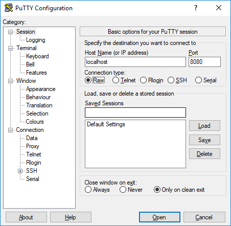

# Gecho

A (very) simple TCP echo server written in Go.

This server implements only the TCP portion of [RFC 0862](https://github.com/hyrmn/gecho/blob/master/docs/rfc0862.txt). Yes, believe it or not, there is an RFC for echo.

## Running

By default, the server will listen on port 7. You can override this via either an environment variable or command-line switch.

### Docker

From a command prompt, build the docker image

```posh
$> docker build -t echo .
```

This will build two docker images. The first is an untagged Golang image for building the code. The second docker image will contain the echo server in an image tagged `echo`. This technique is taken from [Adriaan de Jonge's article](https://medium.com/@adriaandejonge/simplify-the-smallest-possible-docker-image-62c0e0d342ef)

You can then run the docker image. You'll need to bind the port to your host. For example, to bind localhost:7000 to port 7 on the container (the default port) 

```posh
$> docker run --rm -p 7000:7 echo
```

### Command-Line

From a command prompt, run the main.go file

```posh
$> go run main.go
```

This will start the TCP server listening on port 7. 

You can specify another port using the `-p` switch

```posh
$> go run main.go -p 8080
```

Or, set the environment variable `PORT`. In Powershell, you would run

```posh
$> $env:PORT = 7000
$> go run main.go
```

This will start the TCP server on port 7000

Note, if you are on Windows, you will be prompted to allow network access. Select yes.

## Connecting

On Windows, use a telnet client like [PuTTY](http://www.putty.org/). If you're using PuTTY, be sure to connect using the `Raw` connection type. You'll be greeted with a blank window after connecting. Type in some text and press `<enter>`; your message will be repeated back to you.



## Attack surface

All connects are passed off to a goroutine. There is no connection pooling or throttling.

Text from the client is copied directly back to the client's connection. Memory safety is left to Go.

Text is sent back to the client without processing. Text from the client is not logged.

## License

This software is release free and unencumbered under the unlicense. Details in [LICENSE](https://github.com/hyrmn/gecho/blob/master/LICENSE)
